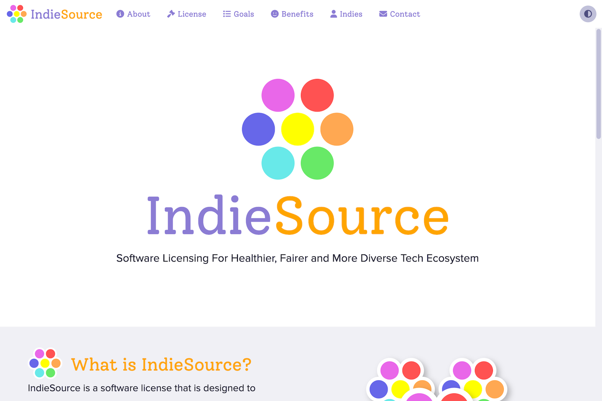

<p align="center" style="text-align:center">
	
</p>

# IndieSource

IndieSource is a software license that is designed to counter the trends towards increasing consolidation and monopolization in the tech industry. We aim to encourage a more diverse and healthier tech ecosystem. Let's work together so that software of all shapes and colors can grow and bloom.


Welcome Screen

## Live Demo

You can create an account and explore the features and benefits of the platform at [indiesource.org](https://indiesource.org).

## Installation

To install and run the application, just type:
```
docker compose up --build
```

## License

Distributed under the <a href="https://indiesource.org/">IndieSource License</a> which allows unrestricted use of the software except by very large corporations. See [LICENSE.md](LICENSE.md) for more information.

## Contact

mailto:admin@indiesource.org
